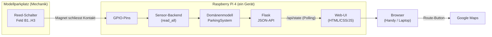
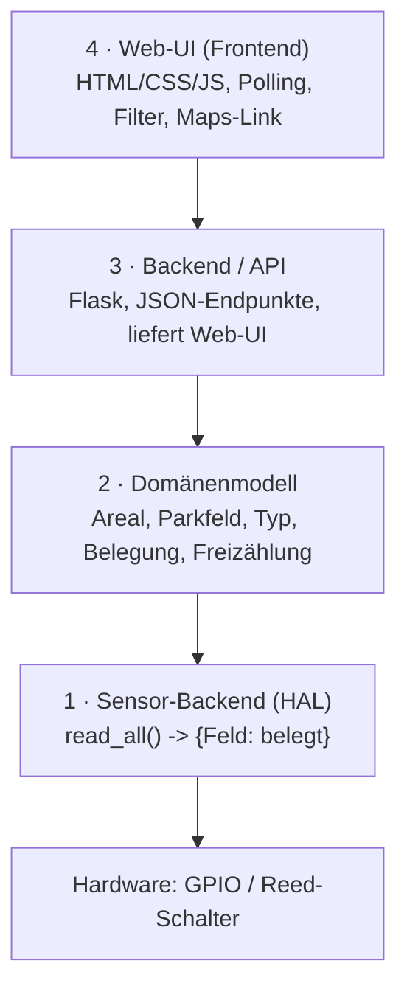
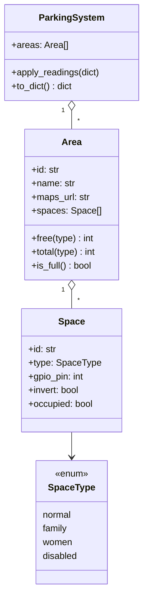

# Architekturkonzept – Teilprojekt Informatik

**Projekt:** ANNA – Smart-Parking-Demonstrator
**Teilprojekt:** Informatik (Teilprojekt 2)
**Autoren:** Faris Ridzal, Mohamed Rumy
**Bezug:** Projektstrukturplan AP 2.3 (Architekturkonzept), Meilenstein M2
**Status:** Freigegeben · Version 1.0 · 18.06.2026

> Dieses Dokument beschreibt die umgesetzte Software-Architektur des
> ANNA-Demonstrators und dient als Grundlage für den Abschlussbericht
> (Word-Export siehe README, Abschnitt „Export").

### Änderungsverlauf

| Version | Datum | Änderung |
|---|---|---|
| 0.1 | – | Erster Entwurf (Schichtenmodell, Schnittstelle zu Elektro). |
| 1.0 | 18.06.2026 | Architektur umgesetzt und verifiziert. Zusätzlich realisiert: Live-Updates per Server-Sent-Events, Auslastungsstatistik und Feld-Reservierung – jeweils als **additive** Endpunkte ohne Änderung am bestehenden API-Vertrag (siehe `docs/API.md`). |

---

## 1 Zweck und Abgrenzung

Dieses Konzept beschreibt die technische Architektur der Software für den
ANNA-Demonstrator. Es legt fest, **wie die Sensordaten vom Modellparkplatz bis
in die Benutzeroberfläche gelangen**, welche Bausteine es dafür gibt und wie die
Schnittstelle zum Teilprojekt Elektro aussieht.

Nicht Teil dieses Dokuments sind die mechanische Konstruktion, die Auswahl der
Sensorbauteile und die elektrische Verdrahtung – diese liegen bei Mechanik bzw.
Elektro. Das vorliegende Konzept definiert jedoch die **Anforderungen an die
Schnittstelle**, damit die Software an die Hardware andocken kann.

## 2 Ausgangslage und Entscheidungsgrundlage

Die wichtigsten projektweiten Entscheidungen (Sitzungsprotokoll 04) sind für die
Architektur bindend:

- **Gewählte Variante: Variante 2 „Komfort".** Anzeige frei/belegt je Parkfeld,
  zusätzlich **Filter nach Parkfeldtyp** (Familie, Frauen, Behinderte). Die
  Anfahrt erfolgt als **Weiterleitung an Google Maps**, es wird **keine eigene
  GPS-Navigation** entwickelt.
- **Rechner: Raspberry Pi 4.** Programmiersprache **Python**.
- **Sensorik: Magnetschalter** (Reed-Kontakt) je Parkfeld für die
  Belegungserkennung.
- **Modell:** zwei Parkareale – *Blumenstrasse* (4 Parkfelder) und *Hauptstrasse*
  (4 Parkfelder), insgesamt 8 Felder. Belegt werden sie durch metallene
  Modellautos (Hot Wheels).

### 2.1 Warum ein Raspberry Pi die Architektur vereinfacht

In den ursprünglichen Arbeitspaketen war noch von einem Arduino die Rede. Mit
dem Wechsel auf den Raspberry Pi 4 ändert sich die Architektur grundlegend zum
Vorteil des Projekts:

| | Arduino (alt) | Raspberry Pi 4 (aktuell) |
|---|---|---|
| Sensoren auslesen | Mikrocontroller, C/C++ | Python über GPIO |
| Webserver / UI | **separates Gerät** nötig | **gleiches Gerät** |
| Verbindung Sensorik ↔ Web | serielles/Netzwerk-Protokoll zwischen zwei Geräten | interner Funktionsaufruf in Python |

Der in den Arbeitspaketen als „existenziell" markierte Punkt – die
Datenschnittstelle zwischen Hardware und Software – wird damit deutlich
entschärft: Sensorauslesung und Webserver laufen **im selben Python-Prozess auf
einem Gerät**. Die Schnittstelle zu Elektro reduziert sich im Wesentlichen auf
die **physische Pin-Belegung** (welcher Sensor an welchem GPIO).

> **Änderungsmanagement:** Der Wechsel „Arduino → Raspberry Pi 4 / Python" ist als
> Änderung in der Änderungsmanagement-Liste zu erfassen (vom Dozenten in SiPro 04
> verlangt).

## 3 Systemüberblick

Der Datenfluss in einem Satz: **Reed-Schalter → GPIO → Sensor-Backend →
Domänenmodell → JSON-API → Web-UI im Browser.**

## 4 Hardwarearchitektur

- **Raspberry Pi 4** als zentrale Steuerung. Versorgt die Logik, hostet den
  Webserver und liest die Sensoren über die GPIO-Leiste.
- **Je Parkfeld ein Reed-Schalter**, angeschlossen zwischen einem GPIO-Pin und
  GND. Über den internen Pull-up-Widerstand liest der Pin im Ruhezustand HIGH;
  schliesst der Magnet den Kontakt, wird der Pin auf GND gezogen (LOW) → Feld
  belegt.
- **Je Parkfeld zwei Status-LEDs** (grün und rot) als Anzeige direkt am Modell:
  frei → grün, belegt → rot. Angeschlossen als GPIO → Vorwiderstand → LED → GND.
  Siehe Abschnitt 4.2.
- **Optional (Erweiterung):** weitere Aktoren wie eine Schranke (Servo) am
  Eingang. In der Software vorgesehen, aber nicht Teil der Grundfunktion.
- **Stromversorgung** wird durch Elektro definiert; aus Software-Sicht genügt es,
  dass der Pi und die Sensoren zuverlässig versorgt sind.

### 4.1 Hinweis zur Sensorwahl (mit Elektro zu klären)

Die Konzeptskizze spricht von „Sensoren, die auf **Metall** ansprechen", das
Protokoll SiPro 04 von **Magnetschaltern**. Das ist nicht dasselbe:

- Ein **Reed-Schalter** schliesst bei einem **Magnetfeld**, nicht bei Metall an
  sich. Ein Hot-Wheels-Auto ist zwar aus Stahl (ferromagnetisch), aber selbst
  kein Magnet. Damit der Reed-Schalter zuverlässig reagiert, muss entweder ein
  **kleiner Magnet unter jedes Auto** geklebt werden, oder
- es wird ein **induktiver Näherungssensor** verwendet, der echtes Metall erkennt.

Für die Software ist dabei nur eines entscheidend: **liefert der Sensor ein
digitales Signal (an/aus) oder ein analoges?** Der Raspberry Pi hat **keinen
analogen Eingang**. Ein digitaler Sensor (Reed-Schalter, viele Induktivsensoren)
hängt direkt am GPIO. Ein analoger Sensor bräuchte zusätzlich einen
A/D-Wandler-Baustein (z. B. MCP3008). Diese Frage gehört in das gemeinsame
Schnittstellen-Arbeitspaket mit Elektro.

### 4.2 Status-LEDs und Pin-Budget

Jedes der 8 Parkfelder erhält eine grüne und eine rote LED. Die Zuordnung folgt
unmittelbar der Belegung: **0 (frei) = grün, 1 (belegt) = rot**. Meldet ein
Sensor gar nichts (Pin defekt oder nicht verdrahtet), bleiben **beide LEDs
dunkel** – eine dunkle Stelle ist ehrlicher als ein grünes Licht, das
fälschlich einen freien Platz verspricht.

| Parkfeld | LED grün (BCM / Header) | LED rot (BCM / Header) |
|---|---|---|
| B1 | 6 / 31 | 12 / 32 |
| B2 | 13 / 33 | 16 / 36 |
| B3 | 19 / 35 | 20 / 38 |
| B4 | 21 / 40 | 26 / 37 |
| H1 | 7 / 26 | 8 / 24 |
| H2 | 9 / 21 | 10 / 19 |
| H3 | 11 / 23 | 18 / 12 |
| H4 | 2 / 3 | 3 / 5 |

**Pin-Budget:** 8 Felder × (1 Sensor + 2 LEDs) = **24 Pins**. Nutzbar sind
GPIO2–27 (26 Pins; GPIO0/1 sind für das HAT-EEPROM reserviert). Frei bleiben
damit nur GPIO14/15, die für die serielle Konsole vorgesehen und deshalb
bewusst nicht verplant sind. GPIO2/3 tragen feste Pull-up-Widerstände auf der
Platine – die daran hängenden LEDs glimmen beim Booten kurz, bis die Software
die Pins als Ausgang setzt. Weitere Aktoren würden einen Portexpander
(z. B. MCP23017 über I2C) oder ein Schieberegister erfordern.

> **Sicherheit:** LEDs sind **Ausgänge**. Ein falsch zugeordneter Ausgangspin
> kann Hardware beschädigen, wenn er gegen einen geschlossenen Schalter oder
> eine andere Quelle treibt. Die Ansteuerung ist daher standardmässig
> abgeschaltet und wird erst durch `"leds_enabled": true` in
> `config/parking_layout.json` aktiv – nachdem Elektro die Pin-Zuordnung
> bestätigt hat. Die Software lehnt zudem jede Konfiguration ab, in der ein
> LED-Pin auf einem Sensorpin oder einer anderen LED liegt.

## 5 Softwarearchitektur

Die Software ist in **vier Schichten** aufgebaut. Jede Schicht kennt nur die
direkt darunterliegende; dadurch sind die Teile einzeln testbar und austauschbar.

1. **Sensor-Backend (Hardware-Abstraktion).** Eine gemeinsame Schnittstelle
   `SensorBackend.read_all()`, die `{Parkfeld-ID: belegt}` liefert. Es gibt zwei
   Implementierungen:
   - `SimulatedSensorBackend` – hält den Zustand im Speicher, für die Entwicklung
     **ohne Raspberry Pi** (Felder per Klick im Web-UI umschalten).
   - `GpioSensorBackend` – liest die echten Reed-Schalter über `gpiozero`.

   Welche Implementierung läuft, entscheidet die Umgebungsvariable
   `ANNA_BACKEND`. **Damit entwickeln wir die komplette Software am Laptop und
   schalten für den Prototyp nur auf das GPIO-Backend um** – „bereit für die
   Sensoren", bevor die Hardware da ist.
2. **Domänenmodell.** Die fachlichen Objekte `Area`, `Space`, `SpaceType` und
   `ParkingSystem`. Hier liegen die Belegungslogik und die Freizählung (gesamt und
   je Typ). Völlig hardware- und web-unabhängig, daher gut mit Unit-Tests
   abgedeckt.
3. **Backend / API.** Ein **Flask**-Server stellt JSON-Endpunkte bereit
   (`/api/state` u. a.) und liefert die Web-UI aus. Ein **Hintergrund-Takt**
   misst zusätzlich unabhängig von HTTP-Aufrufen; nur so stimmen die
   Status-LEDs am Modell auch dann, wenn niemand die Web-App geöffnet hat.
3b. **Aktor-Schicht (`LedBackend`).** Spiegelbildlich zum Sensor-Backend:
   `apply({Feld: belegt})` schaltet die Status-LEDs. Implementierungen
   `GpioLedBackend` (echte Hardware), `SimulatedLedBackend` (nur im Speicher,
   für Entwicklung und Diagnose-Anzeige) und `NullLedBackend` (abgeschaltet).
   Die Farblogik selbst ist eine reine Funktion und ohne Pi testbar.
4. **Web-UI.** Eine responsive Seite (funktioniert im Handy- und Laptop-Browser),
   die `/api/state` im Intervall abfragt und die zwei Areale mit frei/belegt sowie
   den Filtern zeichnet. Ein „Route"-Button öffnet Google Maps.

### 5.1 Technologiewahl und Begründung

| Baustein | Wahl | Begründung |
|---|---|---|
| Sprache | **Python 3** | In SiPro 04 festgelegt; im Team vorhanden. |
| GPIO-Zugriff | **gpiozero** (Backend `lgpio`) | Auf aktuellem Raspberry Pi OS empfohlen; Klasse `Button` passt exakt zum Reed-Schalter (interner Pull-up + Entprellung). Bietet zudem eine Mock-Variante für Tests. |
| Webserver | **Flask** | Schlank, sehr gut dokumentiert, läuft problemlos auf dem Pi und liefert statische Dateien + JSON aus einem Prozess. |
| Frontend | **HTML/CSS/Vanilla-JS** | Keine Build-Kette nötig, direkt vom Pi auslieferbar, leicht zu verstehen und zu präsentieren. |
| Live-Aktualisierung | **Polling** (alle 1,5 s), optional **SSE** | Polling ist die robuste Grundlösung für den Demonstrator. Zusätzlich steht ein Server-Sent-Events-Endpunkt (`/api/stream`) bereit, der Aktualisierungen sofort ohne festes Intervall schiebt. |

*Alternative:* FastAPI + Uvicorn statt Flask, falls asynchrone Live-Updates
(SSE/WebSocket) und automatische API-Dokumentation gewünscht sind. Für den
Funktionsumfang dieses Projekts ist Flask die pragmatischere Wahl.

## 6 Kommunikations- und Schnittstellenkonzept

### 6.1 Interne Kommunikation
Innerhalb des Pi gibt es **kein Netzwerkprotokoll** zwischen Hardware und
Software – das Sensor-Backend wird direkt als Python-Objekt aufgerufen. Zwischen
Backend und Web-UI läuft die Kommunikation über **HTTP/JSON** (die API), was die
Anzeige auch auf einem zweiten Gerät (Handy) im selben Netz ermöglicht.

### 6.2 Externe Schnittstelle zu Elektro (die zentrale Abmachung)
Die Schnittstelle zwischen Informatik und Elektro ist die **GPIO-Pin-Belegung**.
Sie wird in der Datei `config/parking_layout.json` festgehalten – diese Datei ist
das „Vertragsdokument" zwischen den beiden Teams. Elektro trägt ein, welcher
Sensor an welchem Pin hängt; Informatik liest genau diese Felder ein.

> **Massgebliche Fassung:** Die tagesaktuelle Übergabe an Elektro ist
> **`docs/Pinplan.md`** – sie wird aus `config/parking_layout.json` erzeugt
> (`python scripts/pinplan.py --write`) und weist zusätzlich aus, welche Pins
> bereits **bestätigt** und welche noch **Vorschlag** sind. Die Tabellen hier
> sind der Stand für den Bericht; ein Test stellt sicher, dass sie nicht von der
> Konfiguration abweichen.

| Parkfeld | Areal | Typ | GPIO-Pin (BCM) | **Physischer Header-Pin** | Signal |
|---|---|---|---|---|---|
| B1 | Blumenstrasse | normal | 17 | **11** | digital |
| B2 | Blumenstrasse | family | 27 | **13** | digital |
| B3 | Blumenstrasse | women | 22 | **15** | digital |
| B4 | Blumenstrasse | disabled | 23 | **16** | digital |
| H1 | Hauptstrasse | normal | 24 | **18** | digital |
| H2 | Hauptstrasse | normal | 25 | **22** | digital |
| H3 | Hauptstrasse | family | 5 | **29** | digital |
| H4 | Hauptstrasse | normal | 4 | **7** | digital |

> **Beide Spalten sind verbindlich.** Die BCM-Nummer ist die, mit der die
> Software arbeitet; die Header-Nummer ist die, die man an der Steckerleiste
> abzaehlt. Wird nur eine der beiden weitergegeben, entsteht die haeufigste
> Fehlerquelle des Projekts: Als *physischer* Pin waere die Zahl 17 die
> 3,3-V-Versorgung und die Zahl 25 die Masse – beide koennen nie ein
> Sensorsignal liefern. Muss abweichend nach Header-Nummern verdrahtet werden,
> ist in `config/parking_layout.json` `"numbering": "board"` zu setzen; die
> Software rechnet dann selbst um (siehe `docs/Sensor-Inbetriebnahme.md`).

*Die Pins sind Vorschläge und von Elektro zu bestätigen.* Verdrahtung je Sensor:
Reed-Schalter zwischen GPIO und GND, interner Pull-up aktiv (in der Software
gesetzt). Ist ein Sensor verkehrt verdrahtet (belegt/frei vertauscht), kann pro
Feld `"invert": true` gesetzt werden, ohne den Code zu ändern.

### 6.3 Schnittstelle zum Benutzer
Die Anfahrt erfolgt über einen Link auf **Google Maps** (`maps_url` je Areal in
der Konfiguration). Es wird bewusst keine eigene Navigation umgesetzt (Variante 2).

## 7 Datenmodell

Das Modell ist **konfigurationsgetrieben**: Anzahl Areale, Anzahl Felder, Typen
und Pins stehen in `parking_layout.json`. Eine Änderung am Modellparkplatz (mehr
Felder, andere Pins) ist damit eine reine Konfigurationsänderung, kein
Code-Eingriff.

## 8 Belegungslogik

1. Im Polling-Takt ruft das Backend `sensor.read_all()` auf.
2. Das Ergebnis `{Feld: belegt}` wird über `ParkingSystem.apply_readings()` in das
   Modell übernommen.
3. Pro Areal werden freie/belegte Felder gezählt – gesamt und je Typ. Ein Areal
   gilt als „voll", wenn kein Feld mehr frei ist.
4. Entprellung: Der Reed-Schalter kann beim Schliessen prellen; `gpiozero`
   glättet dies über `bounce_time` (in der Konfiguration einstellbar). Das stützt
   das SMART-Ziel „in ≥ 90 % der Fälle korrekte Erkennung".

## 9 Betrieb und Deployment

- **Entwicklung (Laptop):** `python run.py` → Simulator, Web-UI unter
  `http://localhost:5000`. Auf macOS belegt der AirPlay-Empfänger Port 5000;
  dort mit `ANNA_PORT=5050 python run.py` auf einen freien Port ausweichen
  (run.py liest `ANNA_HOST`/`ANNA_PORT`).
- **Prototyp (Raspberry Pi):** `ANNA_BACKEND=gpio python run.py`. Für den
  Dauerbetrieb empfiehlt sich ein Autostart als `systemd`-Dienst (Skizze im
  README).
- Das Handy ruft die Seite über die IP des Pi im selben WLAN auf.

## 10 Annahmen, Risiken und offene Punkte

| Nr. | Punkt | Status / Massnahme |
|---|---|---|
| 1 | Sensor reagiert auf Magnet, nicht auf blankes Metall | Mit Elektro klären: Magnet ans Auto **oder** induktiver Sensor (Abschnitt 4.1). |
| 2 | Digitales vs. analoges Sensorsignal | Bei analog ist ein A/D-Wandler (MCP3008) nötig. Vor der Beschaffung festlegen. |
| 3 | Endgültige GPIO-Pins | Von Elektro zu bestätigen, dann in `parking_layout.json` eintragen. |
| 4 | Anzahl Parkfelder | Aktuell 7 (4 + 3). Durch GPIO-Anzahl nach oben offen. |
| 5 | Live-Update-Verfahren | Polling reicht für die Demo; SSE/WebSocket als Option vermerkt. |

## 11 Ausblick / mögliche Erweiterungen

Bereits umgesetzt (additiv, ohne Änderung am API-Vertrag, siehe `docs/API.md`):
**Live-Updates per Server-Sent-Events** (`/api/stream`), **Auslastungsstatistik**
(`/api/stats`) und **Reservierung einzelner Felder** (`/api/reserve/...`).

Weiterhin offen (nur bei Zeitreserve): Schranke als Aktor, mehrere Stockwerke,
Persistenz der Statistik über Neustarts hinweg.
